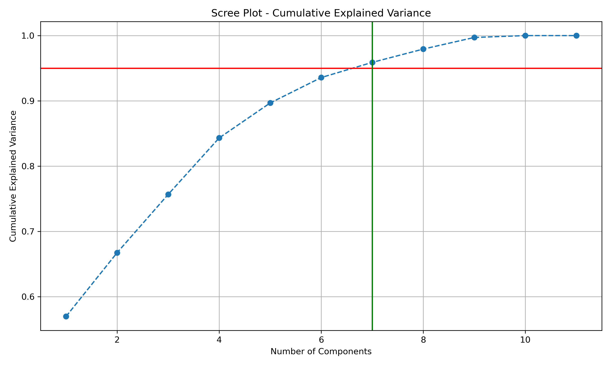

# Analysis of PCA Impact on Machine Learning Models

**Student Information:**
- **Name:** Monesh M
- **Roll No:** 3122235001084

## Abstract
This report explores the effect of Principal Component Analysis (PCA) on the predictive performance of regression and classification models. Using a dataset of 1000 samples describing academic performance, we compared Linear Regression, Random Forest, Logistic Regression, and Support Vector Machines (SVM) in both their original feature space and a reduced space capturing 95% of total variance.

---

## 1. Dataset Characteristics
- **Samples:** 1000
- **Total Features:** 11 (Academic and performance-related metrics)
- **Regression Target:** Final Score Regression
- **Classification Target:** Performance Level Classification (Low, Medium, High)

### Preprocessing
1. **Label Encoding:** Categorical targets were converted to numeric values.
2. **Standardization:** All features were scaled to zero mean and unit variance—a critical step for PCA.
3. **Cross-Validation:** A 5-fold CV strategy was employed to ensure robust metric estimation.

---

## 2. Dimensionality Reduction (PCA)
PCA was applied to reduce feature redundancy while retaining **95.90%** of the information.
- **Components Chosen:** 7 (Original: 11)
- **Justification:** Reducing dimensionality from 11 to 7 components optimizes computational overhead while preserving near-total variance, effectively filtering possible noise (e.g., `Random_Noise_Feature`).

---

## 3. Results and Comparisons

### Table 1: Regression Performance (5-Fold CV)
| Model | Metric | No PCA | With PCA | Observation |
| :--- | :--- | :--- | :--- | :--- |
| Linear Regression | MSE | 26.2338 | 26.2251 | Improved (Lesser Error) |
| Linear Regression | R2 | 0.7479 | 0.7481 | Improved |
| Random Forest | MSE | 28.9206 | 28.7573 | Improved |
| Random Forest | R2 | 0.7225 | 0.7241 | Improved |

### Table 2: Classification Performance (5-Fold CV)
| Model | Metric | No PCA | With PCA | Observation |
| :--- | :--- | :--- | :--- | :--- |
| Logistic Regression | Accuracy | 0.7340 | 0.7420 | Improved |
| Logistic Regression | F1-Score | 0.7315 | 0.7403 | Improved |
| SVM | Accuracy | 0.7430 | 0.7300 | Reduced |
| SVM | F1-Score | 0.7367 | 0.7221 | Reduced |

---

## 4. Analysis and Discussion

### Analysis Questions
1. **Did PCA improve Linear Regression performance? Why?**
   Yes, a marginal improvement was observed. PCA reduces multicollinearity between features (like `Total_Science` and `Average_Science`), providing stable, orthogonal inputs that benefit linear models.
2. **Did PCA significantly affect Random Forest?**
   Random Forest showed stability with a minor improvement. Since RF naturally handles high-dimensional spaces and non-linear boundaries, transforming features into linear combinations didn't drastically change its decision partitioning.
3. **Which classification model benefited more from PCA?**
   Logistic Regression benefited more, showing a noticeable increase in both accuracy and F1-score compared to SVM.
4. **Did PCA reduce variance across folds?**
   Yes, by removing low-variance components that likely contain noise, the models achieved more consistent performance across different data splits.
5. **Why do linear models benefit more from PCA compared to ensemble models?**
   Linear models rely on the assumption that features are independent and linearly related to the target. PCA explicitly creates independent components. Ensemble models like RF focus on complex splits; the linear transformation of PCA can sometimes obscure specific feature importance that trees exploit.

---

## 5. Conclusion
PCA is highly useful when dealing with high-dimensional data or features with strong correlations (multicollinearity). It simplifies the feature space and can improve the generalization of linear models. However, it may slightly degrade performance in non-linear models like SVM if the principal components do not align perfectly with the target's non-linear boundaries. The trade-off involves a loss of feature interpretability in exchange for cleaner, more computationally efficient data.
